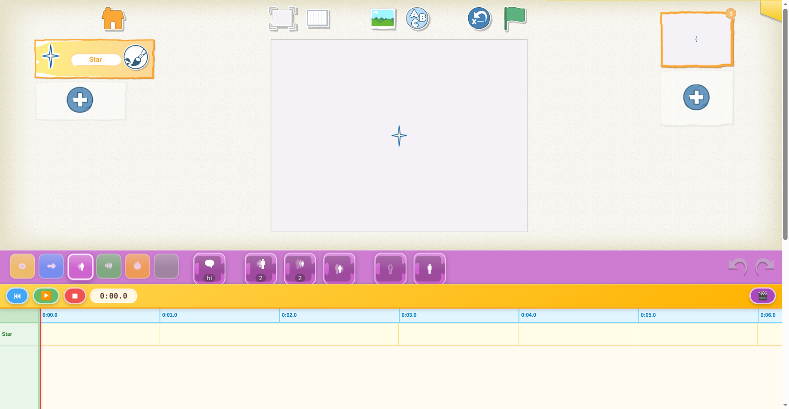

# Magic Tune Jr

A timeline-based clip creator for children aged 5 and up, built on top of [Scratch Jr](https://github.com/LLK/scratchjr).

Children drag motion, looks, and sound blocks from the familiar Scratch Jr palette onto a multi-track timeline. Pressing Play animates sprites in sequence — like a simple animation or music video editor designed for young creators.



## What it does

- **Timeline editor** — one horizontal track row per sprite; clips sit at a time position and have a duration
- **Drag from palette** — grab any Scratch Jr block and drop it onto a sprite's track row to create a clip
- **Transport controls** — ⏮ rewind, ▶ play / ⏸ pause, ⏹ stop; live time counter in mm:ss.t format
- **Playhead** — red vertical line scrubs through the timeline; click or drag the ruler to seek
- **Sprite execution** — clips fire the corresponding Scratch Jr primitive at the right moment, moving / resizing / speaking the sprite on stage
- **Video export** — record the stage to a WebM file (via `VideoExporter`)

## How it works

Magic Tune Jr bundles Scratch Jr as a git submodule and re-uses its engine and asset pipeline. Only the files that differ are kept in this repo; everything else is referenced via symlinks into the submodule.

```
scratchjr/          ← Scratch Jr git submodule (inside this repo)
  src/
    entry/app.js           ← webpack entry point
    editor/
      ScratchJr.js         ← app bootstrap (overrides Scratch Jr's)
      engine/
        TimelineRuntime.js ← replaces Scratch Jr's event-driven runtime
        TimelineDuration.js← clip duration table per block type
        Sprite.js          ← adds .timeline[] and addClip() to sprites
        Page.js            ← null-guards for missing scripts pane
      ui/
        TimelinePane.js    ← ruler, track rows, clip rectangles, playhead
        TimelinePalette.js ← drag-from-palette → create clip
        TransportControls.js
        VideoExporter.js
        UI.js              ← swaps Scratch Jr's scripts area for the timeline
        Palette.js         ← routes block drag to TimelinePalette
        Thumbs.js          ← stubs out ScriptsPane references
```

Symlinks in `src/editor/ui/`, `src/editor/engine/`, and `src/tablet/` point to the corresponding unmodified Scratch Jr source files. `webpack.config.js` sets `resolve.symlinks: false` so the entire import graph resolves through this repo's directory tree — overrides are picked up automatically without any module aliasing.

## Getting started

Scratch Jr is included as a git submodule, so one clone command gets everything:

```bash
git clone --recurse-submodules https://github.com/HappyPeng2x/Magic-Tune-Jr.git
cd Magic-Tune-Jr

# Install Scratch Jr's build dependencies (webpack 4, babel, etc.)
cd scratchjr && npm install && cd ..
```

Then build and serve:

```bash
# one-time build
npm run build

# rebuild on every file change
npm run watch

# serve (any static server works)
python3 -m http.server 8765
# then open http://localhost:8765
```

The build uses webpack 4 from the Scratch Jr submodule (incompatible with webpack 5).

If you already cloned without `--recurse-submodules`:

```bash
git submodule update --init
cd scratchjr && npm install && cd ..
```

## License

Magic Tune Jr is licensed under the **GNU Affero General Public License v3.0 or later** (AGPL-3.0-or-later). See [`LICENSE`](LICENSE) for the full text.

The AGPL v3 was chosen specifically because this software may be run as a network service: anyone who offers Magic Tune Jr over a network must make the complete corresponding source available to their users.

### Scratch Jr

This project builds on [Scratch Jr](https://github.com/LLK/scratchjr), which is copyright © 2016 Massachusetts Institute of Technology and released under the **BSD 3-Clause License**. The full BSD 3-Clause text and copyright notice are reproduced in [`NOTICE`](NOTICE) as required by that license.

The BSD 3-Clause license is permissive and compatible with the AGPL v3: MIT's permissive terms allow the derivative work to be published under a stronger copyleft license. Clause 3 of the BSD license is respected — the name "MIT" is not used to endorse or promote Magic Tune Jr.

Files that originate unchanged from Scratch Jr (referenced here as symlinks) remain under the BSD 3-Clause license. New and modified files contributed to this repository are licensed under the AGPL v3.
